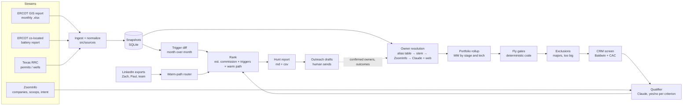

# Pescadora architecture

## What it does

Pescadora turns public project filings into a short, ranked list of the owners we want as clients, each with a reason to call now and a warm way in. It runs the same loop every month, and every human correction makes the next run better.

## The chain

A **project** (e.g., `26INR0123 Albatross BESS`, filed by `Albatross BESS LLC`) belongs to an **owner** (the developer or sponsor). The owner has a **portfolio** (MW by stage and technology). If the portfolio fits a **fly** and survives screening, the owner becomes a **target**.

### 1. Streams: `src/sources/`

| Stream | Status | Notes |
|---|---|---|
| ERCOT GIS report | **Built** | Report type 15933. The document list comes from `/misapp/servlets/IceDocListJsonWS` and the file from `/misdownload/servlets/mirDownload`. Sheets: `Project Details - Large Gen` and `Small Gen`. The header row is found by scanning for `INR`, and merged headers are rebuilt from their sub-header fragments. Also accepts a manually downloaded file (`--file`). |
| ERCOT co-located battery report | Loose parser | Published alongside the GIS report. The layout is unverified: tighten the parser once Paul sends the August 2026 file. |
| Texas RRC | CSV import | Takes a normalized operator CSV (`operator_number, operator_name, active_wells, permits_12m`). A direct bulk-download adapter is Phase 2. |
| ZoomInfo | Interface + API client | `CompanyIntel` has two implementations: `ZoomInfoApi` (Enterprise REST, for unattended runs; field mapping must be checked against Baldwin's contract) and `FileIntel` (results saved from interactive ZoomInfo MCP sessions). |

### 2. Snapshots and triggers: `src/store/`, `src/triggers/`

Every ingest stores the whole snapshot in SQLite (`node:sqlite`, so there are no native dependencies). A diff against the previous snapshot fires triggers, each of which opens a buying window:

| Trigger | What it means | Policy window |
|---|---|---|
| `new_filing` | A new INR in the queue | Genesis: start the relationship |
| `ia_signed` | Interconnection agreement executed | Builder's risk + tax insurance within ~12 months |
| `financial_security_posted` | Financial security / NTP provided | Construction is imminent: quote now |
| `cod_approaching` | Projected COD moved inside the window | Operating program placement |
| `cod_moved`, `capacity_changed` | Plan changed | Update the economics |
| `owner_changed` | The interconnecting entity changed | M&A: a new owner makes a new broker decision |

This is the same idea as the Section 8 play, going in three months before close because insurance is top of mind.

### 3. Owner resolution: `src/resolve/`

This is the hardest link in the chain, because the queue lists SPVs. Resolution runs cheapest and most trustworthy first:

1. **Alias table** (`config/owner-aliases.csv`): human-confirmed mappings. This is the flywheel. Every confirmed answer is stored here and never has to be looked up again.
2. **Stem grouping**: `Albatross Solar LLC` and `Albatross BESS LLC` share the stem `albatross`, so they group as one sponsor.
3. **ZoomInfo** company match, for filers that are the developer itself.
4. **Claude + web search** (`pescadora resolve`): researches the remaining SPVs using press releases, county abatements, and PUCT filings, and writes `data/review/owner-findings.csv` for a person to confirm.

### 4. Flies: `config/flies.ts`, `src/flies/`

Each fly has two parts:
- **Gates**: hard numeric filters, run in code (MW operating, MW pipeline, project size band, COD window, well count). They're deterministic and auditable, and every pass or fail carries a readable reason.
- **Rubric**: judgment calls for the qualifier (independent vs. major, actively growing, complex risk). Each criterion is marked required or not.

### 5. Screening: `config/exclusions.ts`, `src/screen/`

- **Exclusions**: majors and anything too big, matched as whole words against the owner, aliases, and parent.
- **CRM screen**: exports from Baldwin (Salesforce/Stratus) and CAC. A match flags the target as `baldwin_account` or `cac_account` so a person makes the call. It never silently drops the target.

### 6. Qualifier: `src/qualify/`

This is the deterministic yes/no that Zach described:
1. Code applies the numeric gates before any model sees the target.
2. Claude answers each rubric criterion separately (boolean + evidence) using **structured outputs**, a schema-constrained response with no free text to parse.
3. **The verdict is computed in code**: yes only if every required criterion is met and there are no disqualifiers.
4. Answers are **cached by a hash of (model, rubric, dossier)**. The same facts always return the same answer, and only new facts trigger a re-judgment.

Model: `claude-opus-5-5` at low effort, with server-side refusal fallbacks enabled (`fallbacks: "default"`). Override it with `PESCADORA_MODEL`.

### 7. Economics: `src/economics/`

These are Paul's rules of thumb as parameters, tested against his worked examples. The model estimates P&C commission, tax insurance commission, and producer compensation per project and per portfolio, and the estimate drives ranking.

### 8. Routing: `src/route/`

The router uses each person's **official LinkedIn data export** (Connections.csv) and matches connections to target companies, ranked by decision-maker seniority (CEO/CFO/risk first). The report names the best path, e.g., "Dana Reyes, CFO (via Paul)."

### 9. Outreach: `src/outreach/`

Claude drafts a first-touch email in a plain, senior-broker voice, built from the triggers and the warm path. Drafts go to `data/outbox/`, and **a person reviews and sends every one**.

## Design rules

- **Deterministic core, model at the edges.** Ingest, diff, gates, economics, screening, and ranking are pure code with tests. Claude does only the judgment work: research, qualifying, and drafting. Every model decision is cached and auditable.
- **Humans confirm anything that leaves the building.** Owner findings go through a review CSV. Outreach is drafts only.
- **Nothing licensed or personal goes in git.** `data/` is gitignored because it holds ZoomInfo data, LinkedIn exports, CRM exports, and outbox drafts.
- **Revenue, not IT.** Build what finds and wins accounts. If another team wants a copy, agree on how it gets paid for first.

## Compliance notes

- **LinkedIn:** No automated DMs, scraping, or third-party automation on anyone's account. LinkedIn's User Agreement prohibits bots and automated messaging, and it restricts accounts that use them. Paul's and Zach's networks are the most valuable asset in this system. The official data export plus human-sent messages (or Sales Navigator) gets the same routing value without the risk.
- **ZoomInfo:** Use it for targeted research on qualified accounts, not bulk extraction. Keep results local, and follow Baldwin's ZoomInfo terms.
- **Email:** CAN-SPAM applies to commercial email. Every message needs a real sender, a physical address, and a working opt-out.
- **ERCOT and RRC:** Public data. Keep request rates polite and cache what you download.
